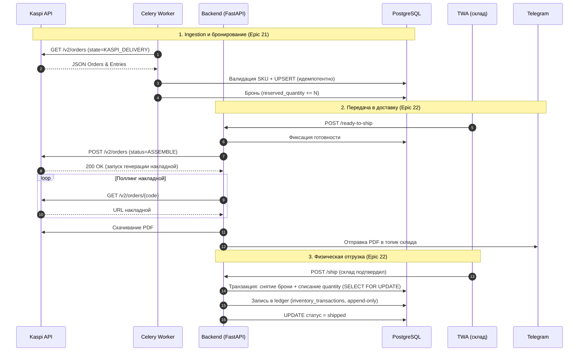

# Sequence-диаграмма: сквозной поток заказа (Kaspi → отгрузка)

Показывает разделение ответственности: внешние вызовы делает только backend (FastAPI) и Celery-воркеры; PostgreSQL — только хранение и транзакционная целостность.

